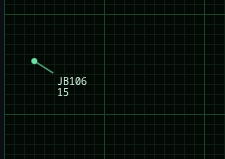
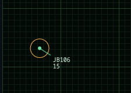
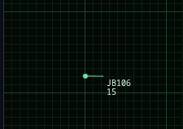
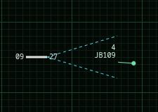
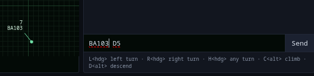
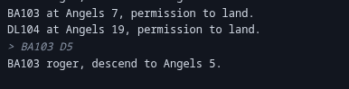

# ARC-Antigravity

Aircraft will enter at the edge of the radar.

Aircraft have a flight number and an altitude in thousands of feet.

The 'dot' is the aircraft. The line is the direction of travel.

Click on the aircraft 'dot' so select the aircraft. It will by highlighted 
with a circle.

Once the plane is highlighted, you have two choices:
- Enter a text command and press `Enter`.
- Click on a destination for the aircraft.

The aircraft pilot will steer as needed to reach the destination.

When the aircraft reaches the destination, it does not stop! It continues 
on its heading until you issue another command.

Your goal is to direct aircraft to "final approach".

The aircraft only needs to enter into the approach vectors heading in 
the right direction. Once inside the approach vectors, the pilot will
steer as need to land.

Aircraft must be between two and five thounsand when entering final 
approach. You must issue a "descend" command for aircraft to change 
altitude. In the lower right is a chat window. Enter the flight number 
and the goal altitude. 

The pilot will acknowledge and steer to the ordered altitude.

